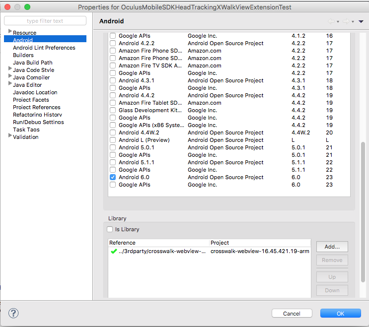

# OculusMobileSDKHeadTrackingXWalkViewExtension

A Crosswalk View extension to expose the [OculusMobileSDKHeadTracking](https://github.com/judax/OculusMobileSDKHeadTracking) mechanism to javascript inside the crosswalk webview.

The OculusMobileSDKHeadTracking project allows to access just the head tracking part from the Oculus Mobile SDK. Using a Crosswalk Extension, this project provides a javascript API so the head tracking information can be consumed from a web application.

## Folder Structure

* **3rdparty**: The third party libraries used to build this library. The Oculus Mobile SDK, the OculudMobileSDKHeadTracking, the Crosswalk WebView and Zebra Crossing.
* **build**: The final build of this library. You can use these final products if you do not want to build the library yourself.
* **java**: The java side of the library. This is the final API that other projects will see/use.
* **javadoc**: The javadoc of the java side of the library.
* **test**: A simple test that shows how to use the library. The test uses a crosswalk webview to provide a full browser test. It also includes a URL intoduction UI with the help of Zebra Crossing for QRCode reading (easing the URL typing).
* **markdown**: Resources used in this markdown documentation.

## Assumptions

* This documentation will assume that you have experience on Android development and more specifically on using Eclipse to develop Android projects.
* This project provides some already built libraries. Of course, you can decide to use other versions of the same libraries or even build them yourself.
* Although some links and information will be provided, some knowledge on Oculus Mobile app development (specifically on the Samsung Gear VR) and Crosswalk development might come handy. 
* You will need to have the Android SDK installed along with Eclipse and the ADT plugin for Eclipse.

## How to use the library

### Use the `test` project

The easiest way to have a glimpse on how to use the library is to check the `test` project. The project is ready to be executed, so just import it to Eclipse. It provides a full "broser-like" experience as it uses the crosswalk webview but it also provides a user interface to introduce the URL to be loaded. The project also has Google's [Zebra Crossing](https://github.com/zxing/zxing) library included to be able to recognize QRCodes, simplifying the URL text introduction. Use this [QRCode Generator](https://www.the-qrcode-generator.com/) to be able to introduce your URLs easily. 

Although every element that is needed to be able to create your own APK is provided, there are two missing pieces:

1. **Copy your OSIG file to the `assets` folder:** In order to work on a Samsung Device you will need to generate your OSIG file and copy it to the `assets` folder of the `test` project. If you do not know what the OSIG file is, you can get some information [here](https://developer.oculus.com/osig/). You may also be interested in knowing more about how to [setup you Samsung device for Gear VR development](https://github.com/judax/OculusMobileSDKHeadTracking#setup-your-samsungoculus-gear-vr).

2. **Import and link the Crosswalk webview Eclipse project:** Although the crosswalk webview project is provided in the `3rdparty/crosswalk-webview-16.45.421.19-arm` folder, you will need to:

  1. Import the crosswalk webview project to the same workspace where the test project has been imported.
  2. Right click on the OculusMobileSDKHeadTrackingXWalkViewExtensionTest project and go to `Properties`. Then select `Android` and at the bottom (you might need to scroll down), remove what is very likely an link error to the crosswalk webview project. Then, press on the `Add` button and select the `crosswalk-webview-16.45.421.19-arm` project (that is an Android library).

  

  More information on how to use the crosswalk webview can be found [here](https://crosswalk-project.org/documentation/embedding_crosswalk.html).

### Use the library in your own project

You might as well want to create your own project that uses the libraries. The final products of this library are stored in the `build` folder. Anyway, remember that this project is dependent on the OculusMobileSDKHeadTracking library and some third party libraries (Crosswalk and the Oculus Mobile SDK). Follow these steps to be able to include the final library in your projects.

1. The OculusMobileSDKHeadTrackingXWalkViewExtension final libraries are available at the `build`. Just copy all the content of this `build` folder to the `libs` folder of your Eclipse project.

2. This project depends on several other projects: OculusMobileHeadTracking, Oculus Mobile SDK and Crosswalk WebView. Luckily, all the libraries are bundled in this project inside the `3rdparty` folder. These are the files you need to copy to the `libs` folder of your Eclipse project:

  * **`3rdparty/OculusMobileSDKHeadTracking`**: Copy everything that is in this folder to the `libs` folder of your Eclipse project.
  * **`3rdparty/ovr_sdk_mobile_1.0.0.0/SystemUtils.jar`**
  * **`3rdparty/ovr_sdk_mobile_1.0.0.0/VrApi.jar`**

  You will also need to include the Crosswalk embed project. Please, read the instruction above on how to include the crosswalk project to the workspace and link it to your project.

3. Use the library inside your code.

  1. Create a XWalkView instance.
  2. Create an `OculusMobileSDKHeadTrackingXWalkViewExtension` instance.
  3. Call the `start` method of the instance passing a reference to the Activity that is using the library (most likely the activity that has instanitated the `OculusMobileSDKHeadTrackingXWalkViewExtension` class).
  4. Call the `getView` method of the instance to get a view that needs to be added somehow in the view hierarchy of your app.
  5. Call the `resume`, `pause` and `stop` methods of the instance in the corresponding `onResume`, `onPause` and `onDestroy` of the Activity.

  Here is some source code of a possible Activity skeleton that uses the library:
  ```
  package com.judax.oculusmobilesdkheadtracking.xwalk.test;
  
  import org.xwalk.core.XWalkView;
  
  import com.judax.oculusmobilesdkheadtracking.xwalk.OculusMobileSDKHeadTrackingXWalkViewExtension;
  
  import android.app.Activity;
  import android.content.Intent;
  import android.os.Bundle;
  import android.view.WindowManager;
  import android.widget.FrameLayout;
  
  public class OculusMobileSDKHeadTrackingXWalkViewActivity extends Activity
  {
  	private XWalkView crosswalkView = null;
  	private OculusMobileSDKHeadTrackingXWalkViewExtension oculusMobileSDKHeadTrackingXWalkViewExtension = null;
  	
  	@Override
  	protected void onCreate(Bundle savedInstanceState)
  	{
  		super.onCreate(savedInstanceState);
  
  		FrameLayout layout = new FrameLayout(this);
  
  		// Create the crosswalk webview
  		crosswalkView = new XWalkView(this);
  
  		// The crosswalk extension to provide the head tracking to JS
  		oculusMobileSDKHeadTrackingXWalkViewExtension = new OculusMobileSDKHeadTrackingXWalkViewExtension();
  		oculusMobileSDKHeadTrackingXWalkViewExtension.start(this);
  			
  		layout.addView(oculusMobileSDKHeadTrackingXWalkViewExtension.getView());
  		layout.addView(crosswalkView);
  
  		setContentView(layout);
  		
  		// Force the screen to stay on, rather than letting it dim and shut off
  		// while the user is watching a movie.
  		getWindow().addFlags( WindowManager.LayoutParams.FLAG_KEEP_SCREEN_ON );
  
  		// Force screen brightness to stay at maximum
  		WindowManager.LayoutParams params = getWindow().getAttributes();
  		params.screenBrightness = 1.0f;
  		getWindow().setAttributes(params);
  		
  		String url = "";
  		Intent intent = getIntent();
  		if (intent != null)
  		{
  			Bundle extras = intent.getExtras(); 
  			if (extras != null) 
  			{
  				url = extras.getString("url");
  			}
  		}
  		crosswalkView.load(url, null);		
  	}
  	
  	@Override protected void onResume()
  	{
  		super.onResume();
  		oculusMobileSDKHeadTrackingXWalkViewExtension.resume();
  	}
  
  	@Override protected void onPause()
  	{
  		oculusMobileSDKHeadTrackingXWalkViewExtension.pause();
  		super.onPause();
  	}
  
  	@Override
  	protected void onDestroy()
  	{
  		oculusMobileSDKHeadTrackingXWalkViewExtension.stop();
  		super.onDestroy();
  	}
  }
  ```

4. Include your Oculus Signature File (OSIG) in the assets folder of your project. You can generate yout Oculus OSIG file at [https://developer.oculus.com/osig/](https://developer.oculus.com/osig/). Check the section above on how to setup your Samsung Device for Gear VR development if necessary.

5. Most likely, you will want to use WebGL in your project. Crosswalk, Chromium, by default does not activate WebGL. In order to enable it you will need to create a text file named `xwak-command-line` inside the `assets` folder of your project. Inside the file you will need to add the following command:

  `xwalk --ignore-gpu-blacklist`

## The JS API

**Work in progress**

## Related Projects

* [OculusMobileSDKHeadTracking](https://github.com/judax/OculusMobileSDKHeadTracking): The Oculus Mobile SDK head tracking handling basic library.
* [OculusMobileSDKHeadTrackingCordovaPlugin](https://github.com/judax/cordova-plugin-oculusmobilesdkheadtracking.git): A Cordova plugin to expose the Oculus Mobile SDK Head Tracking in a JavaScript/browser based environment.
* [OculusMobileSDKHeadTrackingWebVR](https://github.com/judax/OculusMobileSDKHeadTrackingWebVR): A JavaScript file that injects the WebVR API using the underlying Oculus Mobile SDK Head Tracking mechanism exposed to JS through a Crosswalk extension or a Cordova plugin.

IDEAS

* Talk about enabling webgl using the command line file inside assets.
* Future work: Include crosswalk as an AAR